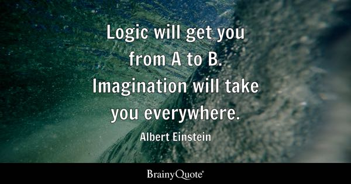

### 
# Hello, I am Vaibhav Lakshmi! 👋

  

  

---

I grew up wanting to make Pixar films. Now I build software systems instead.
- Different medium, same mindset: create things that are thoughtful, reliable, and built with care.
- I am a University of Toronto Computer Science graduate with minors in Economics and Statistics. My experience spans Python engineering, backend workflows, automation, testing infrastructure, data tooling, dashboards, and team-based software development. 
- I like building systems that take messy real-world information and turn it into something structured, useful, and reliable.
- My direction is simple: keep building, keep improving, and become the best kind of software engineer who can design, ship, and own meaningful systems. 
 
 ### Mission 
 To infinity and beyond.
- Build excellent software across backend systems, data engineering, and applied AI — with the goal of becoming a stronger engineer every day.

---

### 🛠️ Tech Stack

---

### 🧰 Tools

---
[LinkedIn ↗](https://linkedin.com/in/vaibhav-lakshmi-santhanam-660401221)  
Always happy to connect with engineers, builders, and curious minds!

<!--
**VaibhavLakshmiS/VaibhavLakshmiS** is a ✨ _special_ ✨ repository because its `README.md` (this file) appears on your GitHub profile.

Here are some ideas to get you started:

- 🔭 I’m currently working on ...
- 🌱 I’m currently learning ...
- 👯 I’m looking to collaborate on ...
- 🤔 I’m looking for help with ...
- 💬 Ask me about ...
- 📫 How to reach me: ...
- 😄 Pronouns: ...
- ⚡ Fun fact: ...
-->
